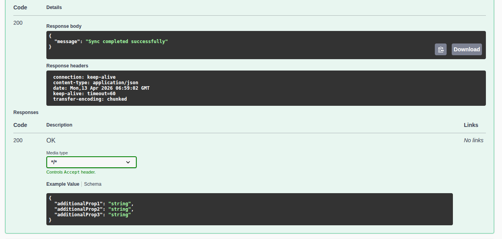
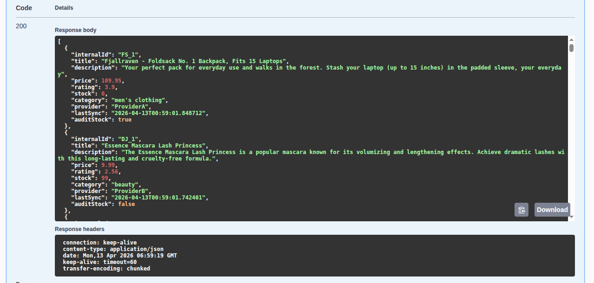
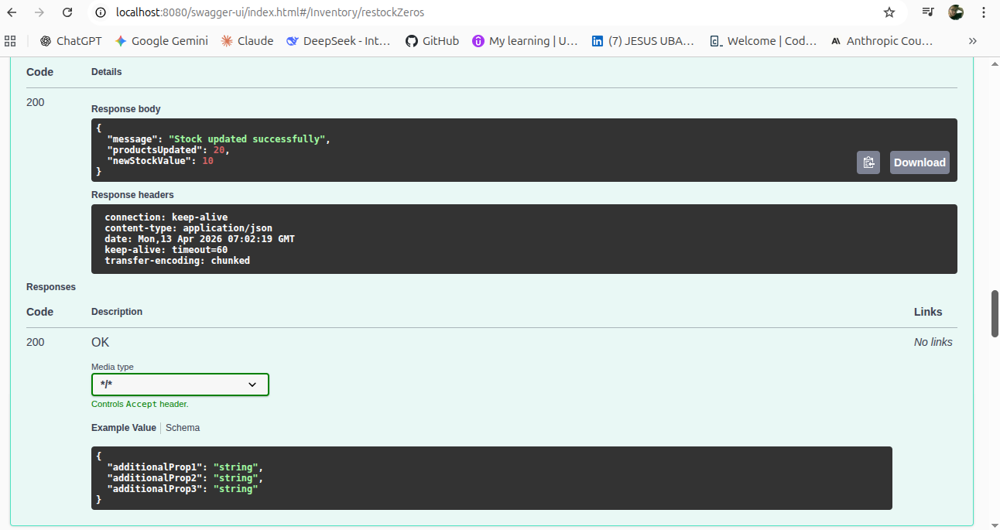
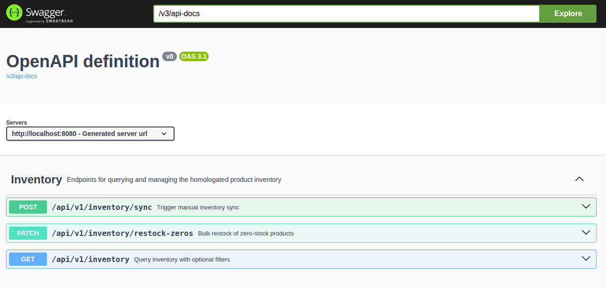

# Inventory Sync API

A middleware microservice that orchestrates product data from two external providers, standardizes it into a canonical model, persists it, and exposes it through a REST API with dynamic filtering capabilities.

---

## Key Features

* Scheduled inventory synchronization every 10 minutes
* Parallel data ingestion using CompletableFuture with a dedicated thread pool
* Graceful degradation when a provider fails
* Canonical data model normalization
* Idempotent persistence to prevent duplicates
* Dynamic filtering at database level (JPA Specifications)
* Bulk stock update endpoint using database-level operations
* OpenAPI / Swagger UI documentation

---

## Architecture Overview

```
┌─────────────────┐     ┌─────────────────┐
│  FakeStore API  │     │  DummyJSON API  │
│ (Provider A)    │     │  (Provider B)   │
└────────┬────────┘     └────────┬────────┘
         │                       │
         └──────────┬────────────┘
                    │ Parallel calls (CompletableFuture)
                    ▼
          ┌─────────────────────┐
          │   InventoryService  │
          │  - Homologation     │
          │  - Cron Job (10min) │
          │  - Idempotent Sync  │
          └──────────┬──────────┘
                     │
                     ▼
          ┌─────────────────────┐
          │     PostgreSQL      │
          │  (products table)   │
          └──────────┬──────────┘
                     │
                     ▼
          ┌─────────────────────┐
          │   REST API          │
          │  GET  /inventory    │
          │  PATCH /restock     │
          │  POST  /sync        │
          └─────────────────────┘
```

---

## Tech Stack

* Java 21
* Spring Boot 3.5.x
* Spring Data JPA (Hibernate)
* PostgreSQL (Docker) / H2 (local)
* Docker & Docker Compose
* Springdoc OpenAPI 2.8.x
* Lombok
* JUnit 5 & Mockito

---

## Running the Project with Docker

### Prerequisites

* Docker installed and running

### Steps

```bash
git clone https://github.com/jesus9611/inventory-sync-api.git
cd inventory-sync-api
docker compose up --build
```

API available at: http://localhost:8080
Swagger UI available at: http://localhost:8080/swagger-ui/index.html

---

## Quick Test (for recruiters)

**1. Trigger a manual sync to populate the database:**

```bash
curl -X POST http://localhost:8080/api/v1/inventory/sync
```



**2. Query all products:**

```bash
curl http://localhost:8080/api/v1/inventory
```



**3. Restock all zero-stock products:**

```bash
curl -X PATCH http://localhost:8080/api/v1/inventory/restock-zeros \
  -H "Content-Type: application/json" \
  -d '{"newStock": 10}'
```



Or explore everything via Swagger UI at `http://localhost:8080/swagger-ui/index.html`



---

## API Endpoints

### GET /api/v1/inventory

Optional filters:

* minRating
* maxPrice
* minStock
* provider

Example:

```bash
curl "http://localhost:8080/api/v1/inventory?minRating=4.0&maxPrice=50&provider=ProviderB"
```

---

### PATCH /api/v1/inventory/restock-zeros

```bash
curl -X PATCH http://localhost:8080/api/v1/inventory/restock-zeros \
  -H "Content-Type: application/json" \
  -d '{"newStock": 10}'
```

---

### POST /api/v1/inventory/sync

```bash
curl -X POST http://localhost:8080/api/v1/inventory/sync
```

---

## Technical Decisions

Idempotent Sync: unique internalId per provider (FS_, DJ_)

Dynamic Filtering: JPA Specifications (DB-level)

Parallel Processing: CompletableFuture with fixed thread pool

Resilience: .exceptionally() per provider

Bulk Updates: @Modifying query (no loops)

Audit: Provider A defaults stock = 0 with audit flag

---

## Testing

```bash
mvn clean test
```

---

## Future Improvements

* Redis caching
* CI/CD pipeline
* Testcontainers

---

## Project Structure

```
src/main/java/com/supplychain/homologator/inventorysyncapi/
├── client/
├── config/
├── controller/
├── domain/
├── dto/
├── exception/
├── repository/
└── service/
```
